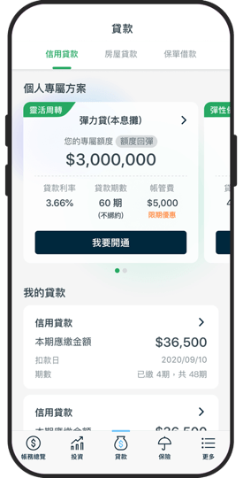
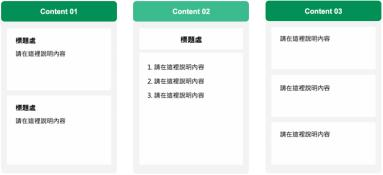
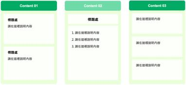
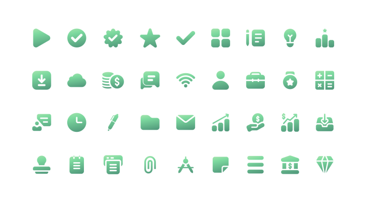

# dataeco_template_source

- Source: `dataeco_template_source.pptx`
- Total slides: 55

## Slide 1

- TITLE
- TITLE

SUBTITLE

國泰金控 部門名稱 有名字

## Slide 2

- TITLE
- TITLE

SUBTITLE

國泰金控 部門名稱 有名字

## Slide 3

- 01 OOOOO
- 01 OOOOO
- 01 OOOOO
- 01 OOOOO
- 01 OOOOO
- 01 OOOOO
- 01 OOOOO
- 01 OOOOO
- 01 OOOOO
- 01 OOOOO
- 01 OOOOO
- 01 OOOOO

- P 03
- P 03
- P 03
- P 03
- P 03
- P 03
- P 03
- P 03
- P 03
- P 03
- P 03
- P 03

CONTENTS

## Slide 4

- 01 OOOOO
- 01 OOOOO
- 01 OOOOO
- 01 OOOOO
- 01 OOOOO
- 01 OOOOO
- 01 OOOOO
- 01 OOOOO
- 01 OOOOO
- 01 OOOOO
- 01 OOOOO
- 01 OOOOO

- P 03
- P 03
- P 03
- P 03
- P 03
- P 03
- P 03
- P 03
- P 03
- P 03
- P 03
- P 03

CONTENTS

## Slide 5

- 10:00 – 11:15 01 OOOO
- 10:00 – 11:15 01 OOOO
- 10:00 – 11:15 01 OOOO
- 01 OOOOO

- P13
- P13
- P13
- 25 Mins

CONTENTS

## Slide 6

- 10:00 – 11:15 01 OOOO
- 10:00 – 11:15 01 OOOO
- 10:00 – 11:15 01 OOOO
- 01 OOOOO

- P13
- P13
- P13
- 25 Mins

CONTENTS

## Slide 7

“

01 TITLE TITLE

”

SUBTITLE

## Slide 8

“

01 TITLE TITLE

”

SUBTITLE

## Slide 9

請在此寫下圖片說明

## Slide 10

請在此寫下圖片說明

## Slide 11

Picture A

Picture B

## Slide 12

Picture A

Picture B

Picture C

請在此寫下圖片說明

請在此寫下圖片說明

請在此寫下圖片說明

## Slide 13

13

## Slide 14

TITLE

請在這裡說明長條圖的內容 contents contents.

Tittle

> [Chart] Chart 10

Lid est laborum dolo rumes fugats untras.

Lid est laborum dolo rumes fugats untras.

Lid est laborum dolo rumes fugats untras.

## Slide 15

TITLE

請在這裡說明表格內容 contents contents.

CONTENT

Tittle

CONTENT

重要訊息標示 Key points

CONTENT

CONTENT

## Slide 16

TITLE

30.5K

請在這裡說明第一項的內容 內容內容內容

Tittle

20.5K

請在這裡說明第二項的內容 內容內容內容

10.5K

請在這裡說明第三項的內容 內容內容內容

## Slide 17

TITLE

Step 1

Step 3

請在這裡說明第一項的內容 內容內容內容內容內容內容 內容內容內容

請在這裡說明第一項的內容 內容內容內容內容內容內容 內容內容內容

Tittle

content

content

Step 4

Step 2

請在這裡說明第一項的內容 內容內容內容內容內容內容 內容內容內容

請在這裡說明第一項的內容 內容內容內容內容內容內容 內容內容內容

content

content

## Slide 18

TITLE

請在這裡說明表格內容 contents contents.

A

B

Tittle

C

## Slide 19

TITLE

Tittle

WHAT

請在這裡說明 why 的內容 內容內容內容

HOW

WHY

請在這裡說明 how 的內容 內容內容內容

WHY

HOW

請在這裡說明 what 的內容 內容內容內容

WHAT

## Slide 20

Tittle

請在這裡說明世界地圖分佈的詳細內容 contents contents.

## Slide 21

TITLE

請在這裡說明地圖分佈的詳細內容

Tittle

重要訊息標示 Key points

## Slide 22

content

content

2

3

Tittle

請在這裡說明第二項內容 contents contents.

請在這裡說明第三項內容 contents contents.

content

content

請在這裡說明第一項內容 contents contents.

請在這裡說明第四項內容 contents contents.

1

4

## Slide 23

content

content

2

3

Tittle

請在這裡說明第二項內容 contents contents.

請在這裡說明第三項內容 contents contents.

content

content

請在這裡說明第一項內容 contents contents.

請在這裡說明第四項內容 contents contents.

1

4

## Slide 24

content

content

2

3

Tittle

請在這裡說明第二項內容 contents contents.

請在這裡說明第三項內容 contents contents.

content

content

請在這裡說明第一項內容 contents contents.

請在這裡說明第四項內容 contents contents.

1

4

## Slide 25

content

content

2

3

Tittle

請在這裡說明第二項內容 contents contents.

請在這裡說明第三項內容 contents contents.

PROJECT

content

content

請在這裡說明第一項內容 contents contents.

請在這裡說明第四項內容 contents contents.

1

4

## Slide 26

請在這裡說明第一個要點

Tittle

請在這裡說明第二個要點

請在這裡說明第三個要點

請在這裡說明第四個要點

## Slide 27

請在這裡說明第一個要點

Tittle

請在這裡說明第二個要點

請在這裡說明第三個要點

請在這裡說明第四個要點

## Slide 28

請在這裡說明第一個要點

Tittle

請在這裡說明第二個要點

請在這裡說明第三個要點

請在這裡說明第四個要點

## Slide 29

請在這裡說明第一個要點

Tittle

請在這裡說明第二個要點

PROJECT

補充說明專案文字內容

請在這裡說明第三個要點

請在這裡說明第四個要點

## Slide 30

請在這裡說明第一個要點

Tittle

請在這裡說明第二個要點

PROJECT

補充說明專案文字內容

請在這裡說明第三個要點

請在這裡說明第四個要點

## Slide 31

TITLE

請在這裡說明圖片內容 contents contents.

Tittle

- 如果有需要字框補充說明 這裡可以補充
- 如果有需要字框補充說明

## Slide 32

TITLE

請在這裡說明圖片內容 contents contents.

Tittle

- 如果有需要字框補充說明 這裡可以補充
- 如果有需要字框補充說明

## Slide 33

TITLE

請在這裡說明圖片內容 contents contents.

Tittle

- 如果有需要字框補充說明 這裡可以補充
- 如果有需要字框補充說明

## Slide 34

PRESENT

2020

2021

2023

2022

TITLE

- Contents contents
- contents contents contents contents

Tittle

- Contents contents
- contents contents

Contents contents

2023

- Contents contents
- contents contents contents contents

- Contents contents
- contents contents contents contents

## Slide 35

Tittle

TITLE

- 請在這裡寫下任何內容，如果需要任何重點標示，可以看一下此段標示方法。
- 請在這裡寫下任何內容，如果需要任何重點標示，可以看一下此段標示方法。
- 請在這裡寫下任何內容，如果需要任何重點標示，可以看一下此段標示方法。

## Slide 36

Tittle

TITLE

- 請在這裡寫下任何內容，如果需要任何重點標示，可以看一下此段標示方法。
- 請在這裡寫下任何內容，如果需要任何重點標示，可以看一下此段標示方法。
- 請在這裡寫下任何內容，如果需要任何重點標示，可以看一下此段標示方法。

## Slide 37

TITLE

Tittle

Content 03

Content 01

Content 02

請在這裡說明內容

標題處

標題處

請在這裡說明內容

- 1. 請在這裡說明內容
- 2. 請在這裡說明內容
- 3. 請在這裡說明內容

請在這裡說明內容

標題處

請在這裡說明內容

請在這裡說明內容

## Slide 38

TITLE

Tittle

Content 03

Content 01

Content 02

請在這裡說明內容

標題處

標題處

請在這裡說明內容

- 1. 請在這裡說明內容
- 2. 請在這裡說明內容
- 3. 請在這裡說明內容

請在這裡說明內容

標題處

請在這裡說明內容

請在這裡說明內容

## Slide 39

TITLE

Tittle

470,000

$65,000

95%

項目標題

項目標題

項目標題

請在這裡說明表格內容 contents contents.

請在這裡說明表格內容 contents contents.

請在這裡說明表格內容 contents contents.

## Slide 40

請在這裡說明表格內容 contents contents.

標題 A

A

Tittle

請在這裡說明表格內容 contents contents.

標題 B

B

請在這裡說明表格內容 contents contents.

標題 C

C

請在這裡說明D內容 contents contents.

標題 D

D

## Slide 41

TITLE

Tittle

請在這裡說明內容

Result

Primary Idea

請在這裡說明內容

PROJECT

請在這裡說明內容

Implementation

Process Planning

請在這裡說明內容

Research

請在這裡說明內容

## Slide 42

TITLE

TITLE

Tittle

TITLE

TITLE TITLE

TITLE

Contents

Contents

Contents

Contents

Contents

- Contents
- Contents
- Contents

TITLE

TITLE

Subtitle

Subtitle

Subtitle

Subtitle

Subtitle

Contents

Contents

Contents

Contents

Contents

Contents

Contents

Contents

Contents

Contents

## Slide 43

Connector

Tittle

content

content

content

content

content

content

content

content

## Slide 44

- Color
- Scheme

主色 80%

#99e891

#6dd9a7

#019056

#3aba8d

#01a964

框底色 10%

強調色 10%

#e6fed2

#f3f3f3

#036b3f

#d9dad9

#f3fc77

## Slide 45

如果需要沈穩的簡報，請以 深色、灰色 為主

#036b3f

#f3f3f3

#01a964

如果需要活潑的簡報，請加上 亮綠色

#99e891

#e6fed2

## Slide 46

Gradient

#3aba8d — #b4f7bb

#01a964 — #24b96e — #99e891

#3aba8d— #86e8b9 — #ebfa7d

## Slide 47

微軟正黑 粗體

36pt

大標一

中文字體

微軟正黑 粗體

25pt

大標二

微軟正黑 粗體

22pt

大標三

微軟正黑 粗體

18pt

副標

微軟正黑 粗體

14pt

內文

微軟正黑

12pt

內文

## Slide 48

Arial Bold

36pt

大標一

English Font

Arial Bold

25pt

大標二

Arial Bold

22pt

大標三

Arial Bold

18pt

副標

Arial Regular

14pt

內文一

Arial Regular

12pt

內文二

## Slide 49

English Font

簡報內文字使用黑色

內文中非重要輔助字可使用灰色

#00000

#7F7F7F

漸層頁文字使用白色

漸層頁中輔助字可使用黃色

#fffff

#f3fc77

## Slide 50

Icon A

常見 icon提供簡報使用，或至線上下載開源圖檔

## Slide 51

Icon B

漸層 icon提供簡報使用，請至壓縮包中下載

## Slide 52

Content

## Slide 53

Content

## Slide 54

THANK YOU!

Need more information? Please contact the Cathay Financial Holding team.

## Slide 55

THANK YOU!

Need more information? Please contact the Cathay Financial Holding team.
